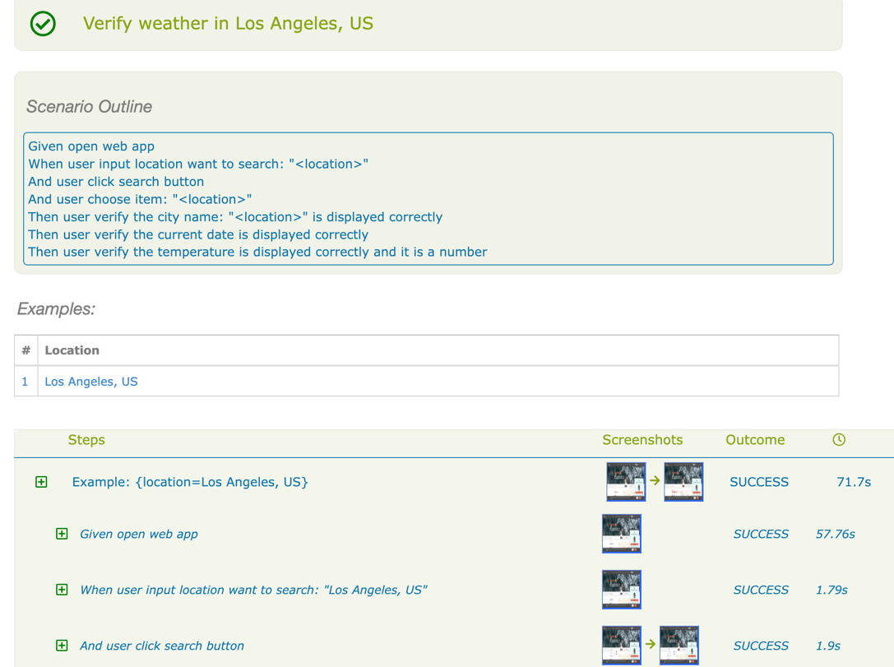

# automation-web-api-demo
# Precondition:
- Setup environment: OpenJDK 11, maven 3.9.0
- Plugin: cucumber for java, gherkin
- Tool: IDE Intellij
- With Web app need to download chromedriver version match Chrome browser installed on local after that copy and paste chromedriver into folder src/test/resources/driver
- Clone project and open with maven project

# Path feature file:
- Project API: features/api/RetrieveInformation.feature
- Project Web: features/web/VerifyWeather.feature

# Run test:
Using maven command line to run test
- Project API:
  mvn clean verify -Dcucumber.options="--tags @api"
- Project Web:
  mvn clean verify -Dcucumber.options="--tags @web"

# Report:
- Report will be generated when run test by maven command line
- Check report on target/site/serenity/index.html file
  
  